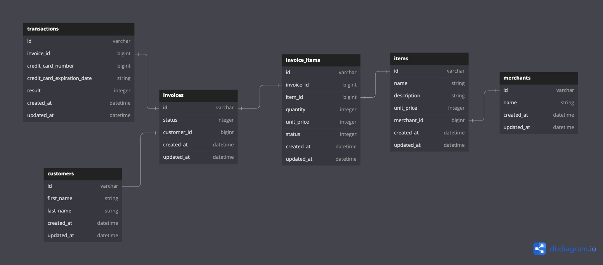

# Little Esty Shop

[deployed site](https://little-shop-7-aef31102292d.herokuapp.com/)

## Background and Description

"Little Esty Shop" is a group project that requires students to build a fictitious e-commerce platform where merchants and admins can manage inventory and fulfill customer invoices."
In this project we build out the fiunctionality of this ficticios marketplace for merchants and sellers, some of our accomplishments in this project include.

- building out a database schema with multiple relationships
- built rake tasks to import data from CSV files
- deployed project to heroku
- followed MVC architecture and REST routing
- followed TDD by testing with RSPEC, making and using factory bots as well as faker
- followed wireframes to design the frontend of our site

## Group Members

Noah Durbin

- [Github](https://github.com/noahdurbin)
- [linkedin](https://www.linkedin.com/in/noahdurbin/?trk=opento_sprofile_topcard)

Aurora Sanderson

- [Github](https://github.com/AuroraTuring)
- [linkedin](https://www.linkedin.com/in/aurora-sanderson/)

Zach Bergman

- [Github](https://github.com/zach-bergman)
- [linkedin](https://www.linkedin.com/in/zacherybergman/)

Austin Kenny

- [Github](https://github.com/AustinKCodes)
- l[inkedin](https://www.linkedin.com/in/austin-kenny-iii/)

## Setup

### requirements 
* ruby version **3.2.2**
* Rails version **7.1.3.3**

---

1. clone repo `git clone git@github.com:zach-bergman/little-shop-7.git`
2. run `bundle install`
3. run `rails db:{drop, create, migrate, seed}`
4. run `rails csv_load:all` to load all data into database
5. run `rails s` and navigate to `localhost:3000` to begin exploring little esty

## Schema

## Resources

[project board](https://github.com/users/zach-bergman/projects/1)

[DTR](https://docs.google.com/document/d/1GXRbbZQJFcbzNzPkxaHsVN3MRXI9GxSJpSXeHT4cFN4/edit?usp=sharing)

## what's next?

- further styling
- customer side